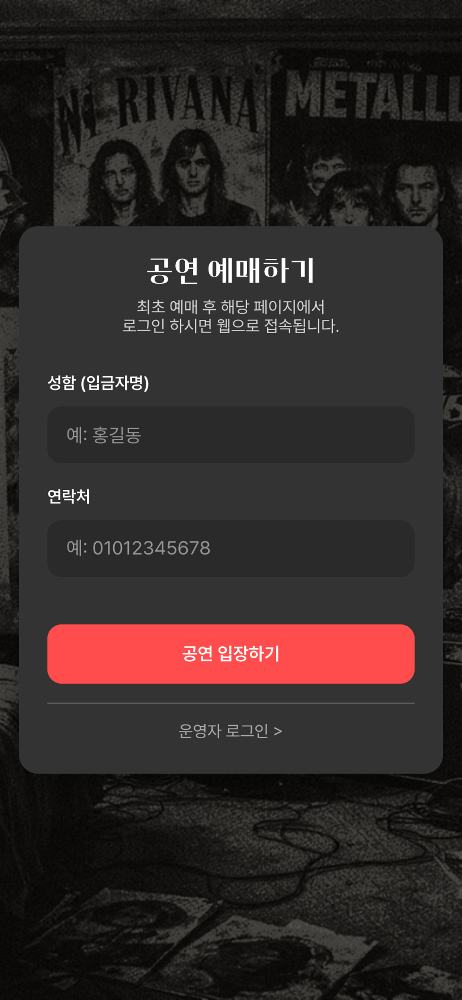
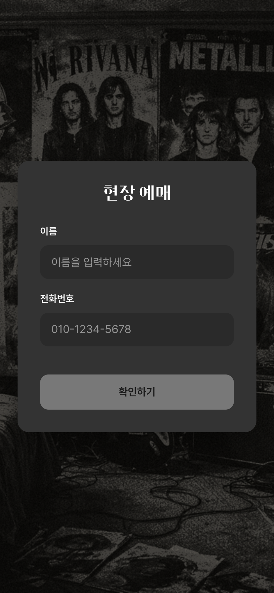
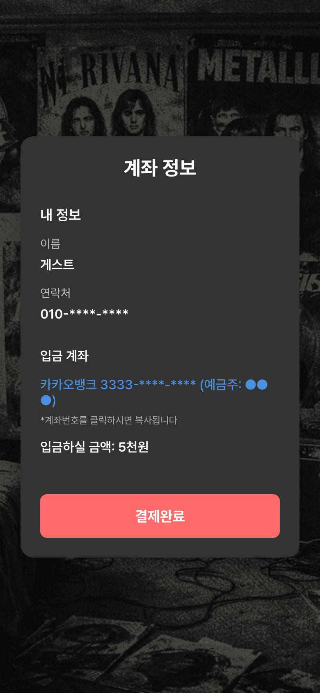
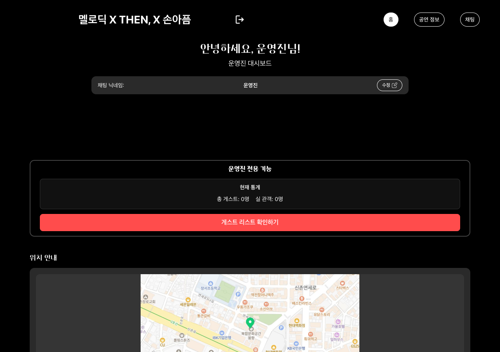
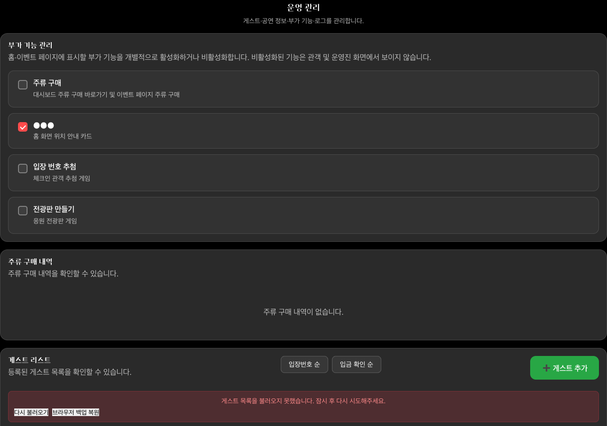
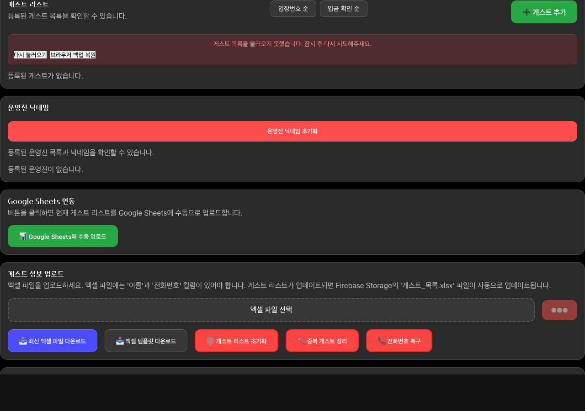
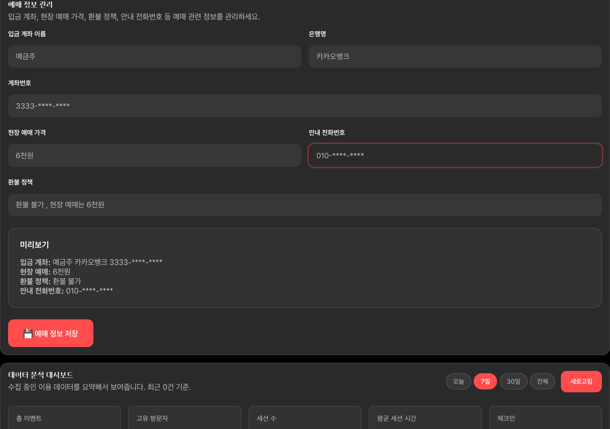
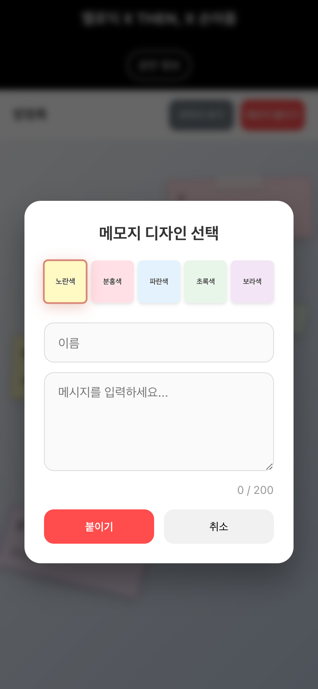
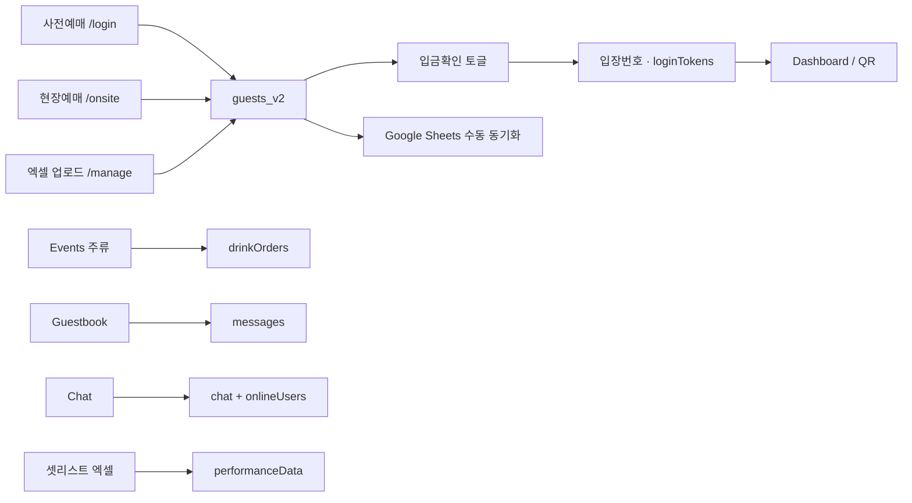

# 밴드 공연 관리 웹

인디/대학 밴드 공연의 **예매 → 입금 확인 → 입장번호·티켓 → 당일 경험(셋리스트·채팅·방명록·주류)** 을 한 웹앱으로 잇는 운영·관객 허브입니다.

실제 공연 적용 사례: **멜로딕 X THEN, X 손아픔** (2026.07.12 · 몽향)

| | |
|---|---|
| 사전/현장 예매 | `/login`, `/onsite` |
| 관객 대시보드 | `/dashboard` |
| 관리자 콘솔 | `/manage` |
| 공연·채팅·방명록 | `/performances`, `/chat`, `/guestbook` |

---

## 왜 만들었나

공연 운영은 보통 **구글폼 · 엑셀 · 카톡 · 계좌 대조**가 흩어집니다.

- 입금자명과 예매명이 어긋나면 톡으로 다시 확인
- 입금 확인과 입장 권한이 단절됨
- 현장 손님·재접속마다 개인 링크를 다시 찾아 보냄
- 티켓·셋리스트·채팅이 제각각이라 관객이 헤맴

이 프로젝트의 목표는 기능 나열이 아니라, **끊긴 흐름을 한 번에 잇는 것**입니다.

```
예매(입력) → 계좌·자가확인(연결) → 입금확인·입장번호(권한) → 티켓/QR·당일 허브(경험)
```

---

## 기능별 설명

### 1. 사전 예매 · 로그인 (`/login`)



| | |
|---|---|
| **하는 일** | 이름(입금자명)·연락처로 예매/재로그인 |
| **왜 필요했나** | 카톡 링크·엑셀 명단 대신, 관객이 같은 URL로 다시 들어와 티켓·당일 화면에 도달해야 함 |
| **수집 데이터** | `name`, `phone`, `bookings/{name_phone}` (`createdAt`, `approved`) |

---

### 2. 현장 예매 (`/onsite`)





| | |
|---|---|
| **하는 일** | 현장 손님 이름·연락처 입력 → 계좌/금액 안내(클릭 복사) → 결제완료 → QR·개인 링크 |
| **왜 필요했나** | 당일 손님은 사전 명단에 없고, 계좌를 톡으로 반복 공유하면 실수가 잦음. 키오스크형 원화면으로 예매·입금 안내를 끝냄 |
| **수집 데이터** | `isWalkIn: true`, `paymentConfirmed` (현장은 결제완료 시 확인 처리), 입장번호·토큰 링크 |

---

### 3. 관객 · 운영진 대시보드 (`/dashboard`, `/admin/dashboard`)



| | |
|---|---|
| **하는 일** | 티켓·타임라인·닉네임·주류 바로가기. 운영진은 **현재 통계**(총 게스트 / 실 관객)와 게스트 리스트 확인 |
| **왜 필요했나** | 입금 후에도 “내 티켓·셋리스트·채팅이 어디?”가 반복됨. 한 홈에서 당일 경험을 묶음 |
| **운영 KPI** | `총 게스트` = 삭제되지 않은 게스트 수<br>`실 관객` = `paymentConfirmed === true` 인 게스트 수 |

---

### 4. 관리자 페이지 (`/manage`)







| 섹션 | 역할 | 왜 필요했나 |
|------|------|-------------|
| **게스트 리스트** | 입금확인 토글, 입장번호 순/입금확인 순 정렬, 사전·현장 뱃지, 수동 추가 | 입금 대조와 입장 권한을 한 화면에서 |
| **엑셀 업로드** | 이름·전화번호·입금확인 일괄 반영, Storage `게스트_목록.xlsx` 동기화 | 기존 사전 예매 명단을 버리지 않고 이관 |
| **Google Sheets** | 게스트+닉네임+예매일시 수동 업로드 | 현장 밖에서도 명단을 스프레드시트로 공유 |
| **주류 구매 내역** | 맥주/모히토 수량·금액·제공 여부 | 당일 바 매출·미제공 주문 추적 |
| **셋리스트·공연진** | 엑셀 업로드 / 자동 추출 / 수동 추가 | 셋리스트와 운영진 로그인 권한의 기준 |
| **예매 정보** | 계좌·현장가·환불·안내 전화 | 관객 화면의 입금 안내 단일 소스 |
| **응원·채팅 관리** | 곡별 응원 메시지 엑셀 export, 채팅 일괄 삭제 | 공연 후 아카이브·초기화 |

---

### 5. 공연 정보 · 방명록 · 채팅



| 화면 | 역할 | 왜 필요했나 |
|------|------|-------------|
| **공연 정보** | 티켓 메타·셋리스트·공연진·타임라인 | 종이 셋리스트/포스터 대신 당일 기준 정보 |
| **방명록** | 메모지 UI로 메시지 남기기 | 공연 후기·응원을 디지털로 남김 |
| **채팅** | 실시간 채팅 + 온라인 인원 | 대기열·공연 중 관객·운영 소통 |
| **기타(이벤트)** | 주류 주문, 룰렛/추첨/전광판 등 | 당일 부대 경험을 같은 앱에 묶음 |

---

## 데이터는 어떻게 모이나



| 저장소 | 주요 필드 |
|--------|-----------|
| **Firestore `guests_v2/all`** | `name`, `phone`, `isWalkIn`, `paymentConfirmed`, `paymentConfirmedAt`, `entryNumber`, `ticketReceived`, `checkedIn`, `isDeleted` |
| **`bookings/{name_phone}`** | 예매 신청 시각·승인 |
| **`bookingInfo/main`** | 계좌, 현장가, 환불, 연락처 |
| **`performanceData/main`** | ticket, setlist, performers, events |
| **`drinkOrders`** | 수량, `totalAmount`, 입금/제공 여부, `orderHistory` |
| **`messages` / `chat` / `songComments`** | 방명록·채팅·곡별 응원 |
| **localStorage** | `guests_v2`, `bookingInfo`, `performanceData` (오프라인 보조) |
| **Firebase Storage** | `guests/게스트_목록.xlsx` |
| **Google Sheets** | 운영용 미러 (닉네임·예매일시 포함) |

---

## 관리자 데이터 분석 (실제 Firestore 기준)

분석 시점: 공연 메타·참여 데이터가 Firestore에 남아 있는 상태를 기준으로 정리했습니다.  
(`guests_v2`는 배포 규칙상 외부 직접 조회가 막혀 있거나 공연 후 초기화된 상태로, **게스트 수 KPI는 대시보드·관리자 화면의 집계 로직**을 기준으로 설명합니다.)

### 1) 공연 운영 메타 (확인됨)

| 항목 | 값 |
|------|-----|
| 공연명 | **멜로딕 X THEN, X 손아픔** |
| 일시 | 2026년 7월 12일 (일) |
| 장소 | 몽향 (서대문구 연세로5다길 10 지하 1층) |
| 좌석 | 자유석 |
| 셋리스트 | **24곡** |
| 공연진(운영진 포함 명단) | **38명** |
| 타임라인 | 관객 입장 16:30 → 멜로딕 17:00 → 손아픔 18:00 → THEN, 19:00 |
| 입금 계좌 | 카카오뱅크 / 예금주 ●●● (계좌번호 마스킹) |
| 가격 안내 | 현장 예매 기준 안내(관리 화면·`bookingInfo`에 반영) |

셋리스트 일부: 잘부탁드립니다(익스), 첫사랑(버스커버스커), 자처(한로로), …, 이름(Then,), 들키고 싶은 마음에게(이승윤)

### 2) 관객 퍼널 KPI (관리자·대시보드가 보는 방식)

운영진 대시보드 **현재 통계**와 게스트 리스트 필드로 아래를 계산합니다.

| KPI | 정의 | 인사이트 |
|-----|------|----------|
| 총 게스트 | `!isDeleted` | 명단 규모 |
| 실 관객 | `paymentConfirmed === true` | 실제 입금·입장 권한 부여 규모 |
| 입금 전환율 | 실 관객 ÷ 총 게스트 | 미입금 잔여·리마인드 필요성 |
| 사전 vs 현장 | `isWalkIn` | 당일 비중·키오스크 부하 |
| 티켓 수령률 | `ticketReceived` | 입구 병목 |
| 입장번호 부여율 | `entryNumber != null` | 추첨·스탬프 준비도 |
| 예매→입금 지연 | `bookings.createdAt` vs `paymentConfirmedAt` | 입금 독촉 타이밍 |

게스트 리스트의 **「입금 확인 순」** 정렬은 미확인 건을 위로 올려, 공연 직전 운영자가 미입금 큐만 빠르게 처리하도록 설계되어 있습니다.

### 3) 참여·매출 보조 지표 (확인됨)

| 소스 | 관측 | 해석 |
|------|------|------|
| 방명록 `messages` | 메모지 메시지 다수 게시(공연명 배너와 함께 노출) | 공연 후기·응원 채널로 사용됨 |
| 채팅 `chat` | 운영진·게스트 메시지 기록 (발신자 실명은 비공개) | 당일 실시간 소통 채널로 동작 |
| 주류 `drinkOrders` | 관리자 **주류 구매 내역**으로 건별 수량·금액·제공 여부 확인 | 바 매출·미제공 주문 운영 |
| Google Sheets | 수동 업로드 버튼으로 명단 외부 공유 | 엑셀 중심 운영과의 브리지 |

### 4) 분석에서 드러난 운영 패턴

1. **입금 확인이 권한의 스위치**  
   채팅·일부 이벤트는 `paymentConfirmed` 이후에만 열려, “명단 등록 ≠ 실 관객”을 코드로 강제합니다.
2. **사전/현장 이원화**  
   같은 게스트 스키마에 `isWalkIn`만 갈라, 당일 비중을 나중에 나눠 볼 수 있습니다.
3. **공연 콘텐츠는 풍부, 집계 UI는 얇음**  
   셋리스트 24곡·공연진 38명·타임라인 4단은 잘 들어가 있지만, 관리자 화면은 리스트·토글 중심이라 **차트형 인사이트는 아직 부족**합니다. (개선 과제)

---

## 앞으로 어떻게 개선할지

데이터가 이미 Firestore에 쌓이는 구조를 전제로, **새 수집보다 집계·자동화**를 우선합니다.

### Phase 1 — 관리자 인사이트 패널 (`/manage` 상단)

- 사전/현장 비율, 입금 전환율, 미입금 N시간 이상 건수
- 티켓 미수령 · 입장번호 미부여 알림
- 주류: 맥주/모히토 합계, 매출 합, 미제공 건수

### Phase 2 — 퍼널·타이밍

- 예매 생성 → 입금 확인 중앙값/평균 지연
- 시간대별 현장 예매·주류 주문 피크 (입구·바 인력 배치)
- 곡별 응원(`songComments`) 히트맵 → 셋리스트 피드백

### Phase 3 — 운영 자동화

- Google Sheets **자동** 동기화(현재는 수동)
- 미입금 리마인드(문자/메일 — 선택)
- 공연 종료 후 익명화된 KPI 스냅샷 export (다음 공연 벤치마크)

### Phase 4 — 범위 밖의 것 (당분간 안 함)

- PG 자동결제 (계좌이체 안내 유지)
- 다중 공연 SaaS / 테넌트
- 네이티브 앱·푸시
- 좌석 지정·실시간 좌석맵

---

## 기술 스택

- React 18 · TypeScript · Vite · React Router
- Firebase (Firestore · Storage)
- xlsx (엑셀 업로드/다운로드)
- Google Apps Script (Sheets 연동)

## 시작하기

```bash
npm install
npm run dev
```

브라우저: `http://localhost:5173`

환경 변수는 `.env.local`에 `VITE_FIREBASE_*`, `VITE_GOOGLE_SHEETS_WEB_APP_URL` 을 넣습니다. (`.env` / `.env.local` 은 gitignore)

### 빌드

```bash
npm run build
npm run preview
```

## 주요 경로

| 경로 | 설명 |
|------|------|
| `/login` | 사전 예매·로그인 |
| `/onsite` | 현장 예매 |
| `/dashboard` | 관객 홈 |
| `/manage` | 관리자 콘솔 |
| `/admin/login` | 운영진 로그인 |
| `/performances` | 공연 정보 |
| `/chat` | 채팅 |
| `/guestbook` | 방명록 |
| `/events` | 주류·미니게임 등 |
| `/t/:token` | 개인 티켓 링크 |
| `/intro.html` | 사업소개 HTML (5장) |

## 엑셀 게스트 형식

필수 컬럼: `이름` / `name`, `전화번호` / `phone`  
선택: `입금확인` (확인완료, Y, 1 등)

## 라이선스

MIT
